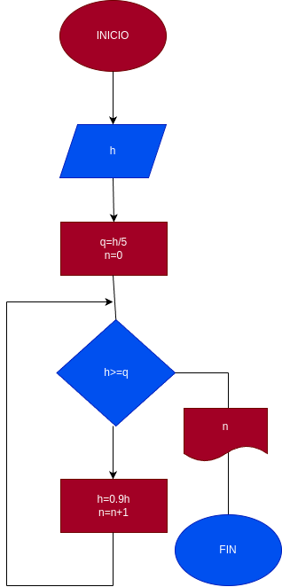

# While_2
segundo ejercicio usando while

## input
 h = altura

 q = 1/5 de la altura

 n = numero de rebotes

 ## proccesing

 - q = h/5
 - n = 0

 - h > = q
 
 - h = 0.9h
 - n = n + 1

 se repite asta que de la 1/5 de la altura

 ## Diseño

 